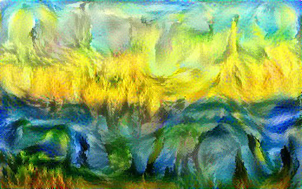

# Neural Style Transfer

An Implementation of Neural Style Transfer using Tensorflow.

  
  
  
   
  
  
  
   
  
  
  
   
  
  
  

## Dependencies

- [TensorFlow](https://www.tensorflow.org/)
- [NumPy](https://numpy.org/)
- [Pillow](https://pypi.org/project/Pillow/)
